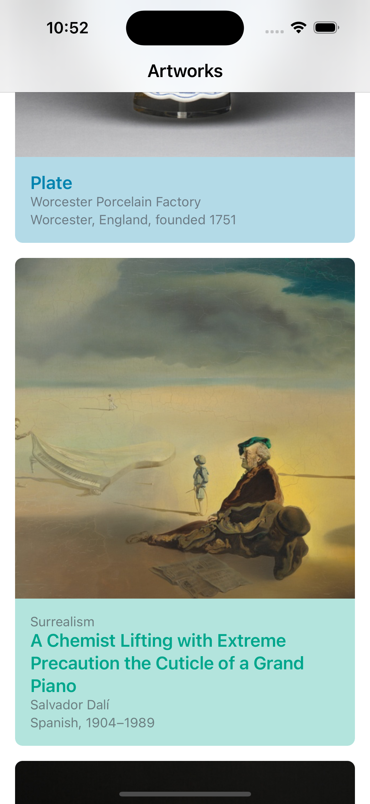
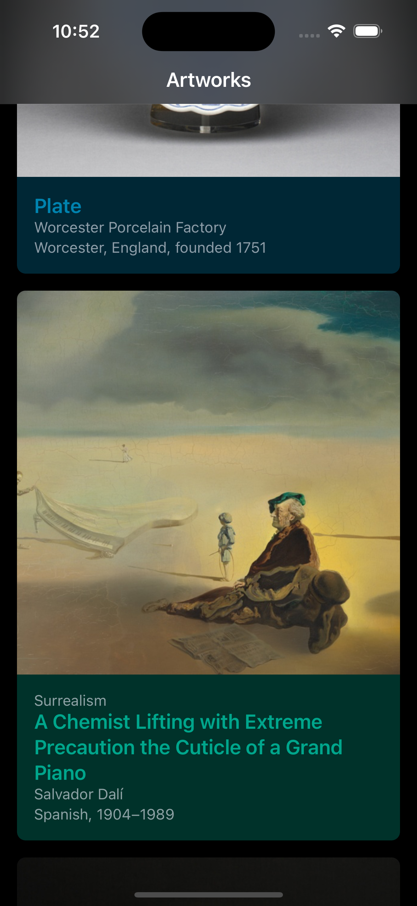

# Artworks

The iOS mobile app displaying the list of images, books, and other types of artwork from the publicly available [Art Institute of Chicago API](https://api.artic.edu/docs/).
It is a starter project for analytics and performance mobile workshops.

### For all students
- In the test module, there's a dedicated `TestingApDelegate` class that allows us to not run the app without attaching an initial view controller.
- You'll handle server errors (5xx) differently from others in the presentation layer.
- `ArtworkListComposer` is responsible for building `ArtworkListViewController` - all dependencies should be initialized there.
- Do not use storyboards - simple but programmatic UI

## Screenshots

